# 📚 JavaScript Tips, Tricks and Best Practices

<a id="how-to-reverse-an-array-using-reverse-method"></a>

### [How to Reverse an Array Using `reverse` Method](#how-to-reverse-an-array-using-reverse-method)

Code:

```javascript
const originalArray = ['👶', '👦', '👨', '👴'];

const newArray = originalArray.reverse();

console.log(originalArray);
console.log(newArray);

// originalArray result
// ['👴', '👨', '👦', '👶']

// newArray result
// ['👴', '👨', '👦', '👶']
````

Image:

<p></p>

<a id="how-to-reverse-an-array-using-slice-and-reverse-method"></a>

### [How to Reverse an Array Using `slice` and `reverse` Method](#how-to-reverse-an-array-using-slice-and-reverse-method)

Code:

```javascript
const originalArray = ['👶', '👦', '👨', '👴'];

const newArray = originalArray.slice().reverse();

console.log(originalArray);
console.log(newArray);

// originalArray result
// ['👶', '👦', '👨', '👴']

// newArray result
// ['👴', '👨', '👦', '👶']
```

Image:

<p></p>

### [How to Reverse an Array Using spread and `reverse` Method](#how-to-reverse-an-array-using-spread-and-reverse-method)

Code:

```javascript
const originalArray = ['👶', '👦', '👨', '👴'];

const newArray = [...originalArray].reverse();

console.log(originalArray);
console.log(newArray);

// originalArray result
// ['👶', '👦', '👨', '👴']

// newArray result
// ['👴', '👨', '👦', '👶']
````

Image:

<p>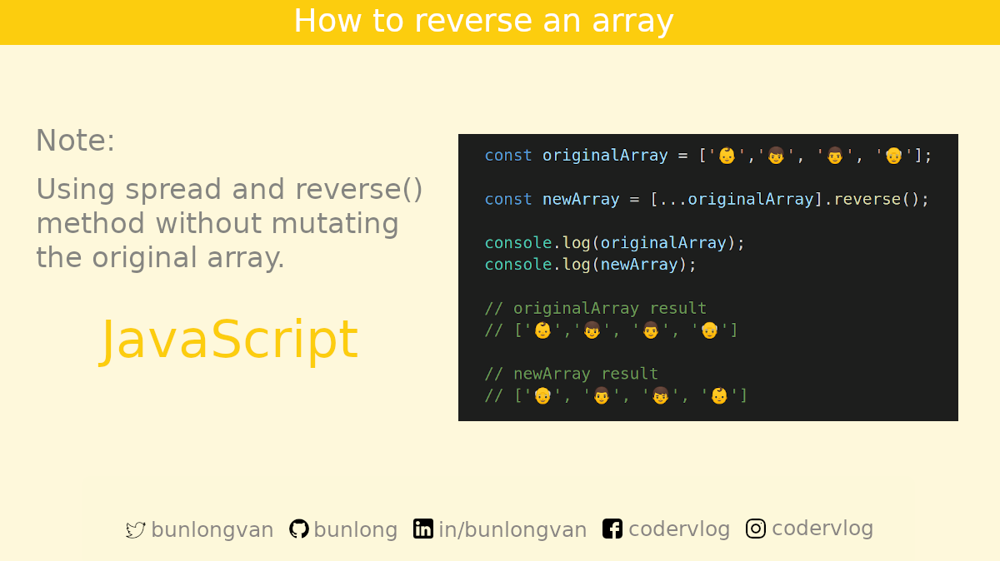</p>

### [How to Reverse an Array Using `reduce` Method and Spread](#how-to-reverse-an-array-using-reduce-method-and-spread)

Code:

```javascript
const originalArray = ['👶', '👦', '👨', '👴'];

const newArray = originalArray.reduce((accumulator, value) => {
	return [value, ...accumulator]
}, []);

console.log(originalArray);
console.log(newArray);

// originalArray result
// ['👶', '👦', '👨', '👴']

// newArray result
// ['👴', '👨', '👦', '👶']
```

Image:

<p>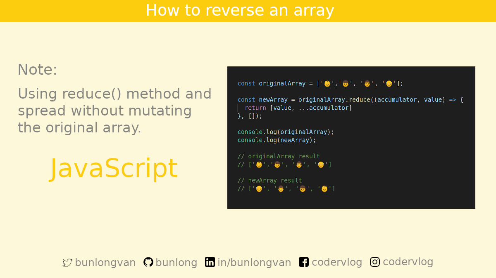</p>

### [How to Reverse an Array Using `reduceRight` Method and Spread](#how-to-reverse-an-array-using-reduceright-method-and-spread)

Code:

```javascript
const originalArray = ['👶', '👦', '👨', '👴'];

const newArray = originalArray.reduceRight((accumulator, value) => {
	return [...accumulator, value]
}, []);

console.log(originalArray);
console.log(newArray);

// originalArray result
// ['👶', '👦', '👨', '👴']

// newArray result
// ['👴', '👨', '👦', '👶']
```

Image:

<p>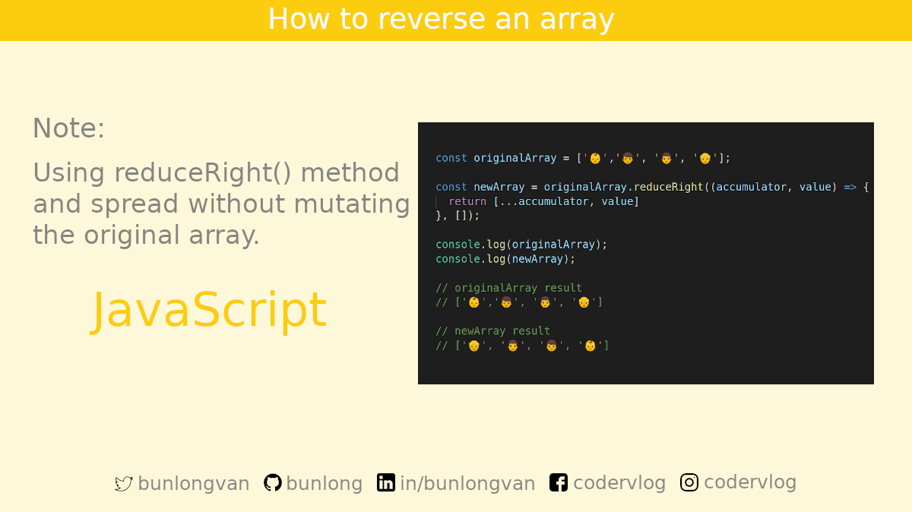</p>

### [How to Reverse an Array Using `reduceRight` and `push` Method](#how-to-reverse-an-array-using-reduceright-and-push-method)

Code:

```javascript
const originalArray = ['👶', '👦', '👨', '👴'];

const newArray = originalArray.reduceRight((accumulator, value) => {
	accumulator.push(value);
	return accumulator;
}, []);

console.log(originalArray);
console.log(newArray);

// originalArray result
// ['👶', '👦', '👨', '👴']

// newArray result
// ['👴', '👨', '👦', '👶']
```

Image:

<p>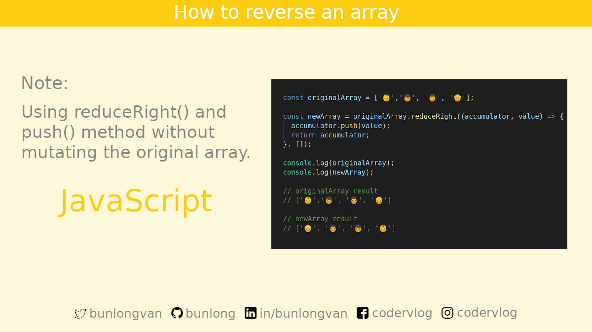</p>

### [No "And" in Function Name](#no-and-in-function-name)

Code:

```javascript
// Code Smell: No "And" in Function Name

// ❌ Bad
function teaAndSugar

// ✅ Better
function tea
function sugar
```

Image:

<p>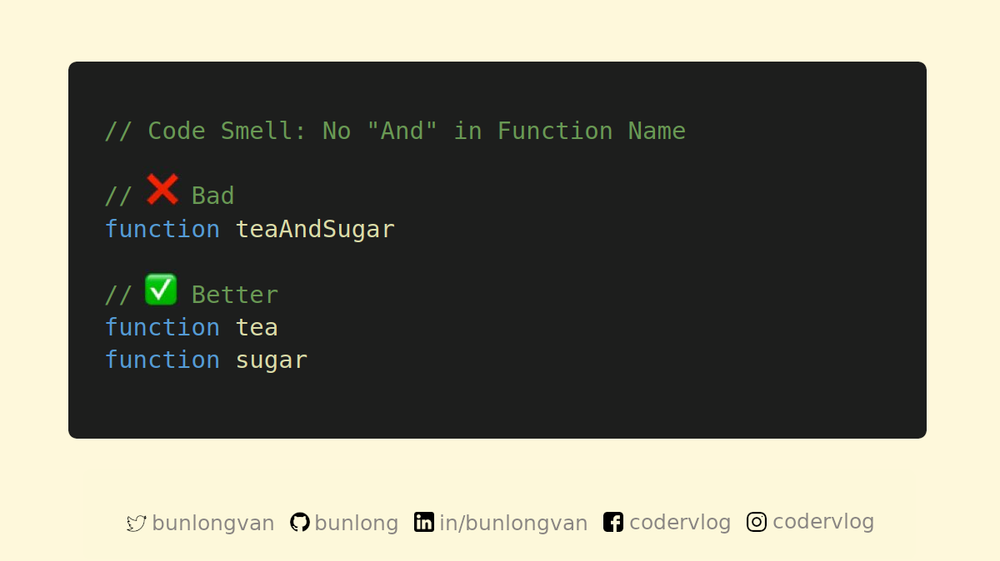</p>

### [How to Clone Object Using Spread](#how-to-clone-object-using-spread)

Code:

```javascript
const food = { beef: '🥩', bacon: '🥓' };

const cloneFood = { ...food };

console.log(cloneFood);

// cloneFood result
// { beef: '🥩', bacon: '🥓' }
```

Image:

<p>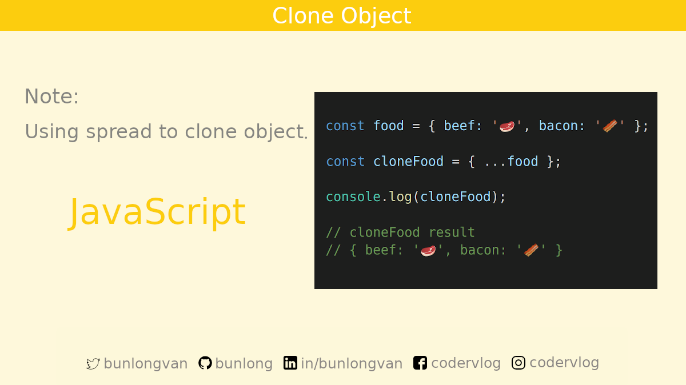</p>

### [How to Clone Object Using `Object.assign` Method](#how-to-clone-object-using-object-assign-method)

Code:

```javascript
const food = { beef: '🥩', bacon: '🥓' };

const cloneFood = Object.assign({}, food);

console.log(cloneFood);

// cloneFood result
// { beef: '🥩', bacon: '🥓' }
```

Image:

<p>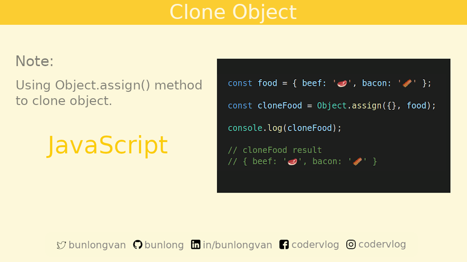</p>

### [How to Clone Object Using `JSON`](#how-to-clone-object-using-json)

Code:

```javascript
const food = { beef: '🥩', bacon: '🥓' };

const cloneFood = JSON.parse(JSON.stringify(food));

console.log(cloneFood);

// cloneFood result
// { beef: '🥩', bacon: '🥓' }
```

Image:

<p>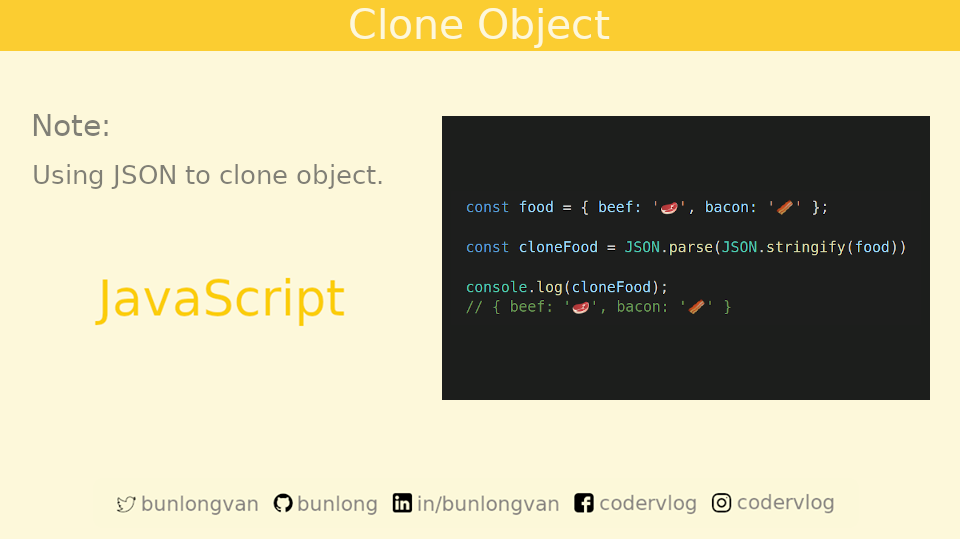</p>

### [Dynamic Import](#dynamic-import)

✅ Use cases of Dynamic Import:

1️⃣ Import a module on-demand (or conditionally)  
2️⃣ Compute the module specifier at runtime  
3️⃣ Import a module from within a regular script (as opposed to a module)

Code:

```javascript
import('./utils/log.js')
  .then((module) => {
    // Do something with the module
    module.doSomething();
  });

// Since import() returns a promise,
// it's possible to use async/await instead of
// the then-based callback style

(async () => {
  const module = await import('./utils/log.js');
  // Do something with the module
  module.doSomething();
})();
```

Image:

<p>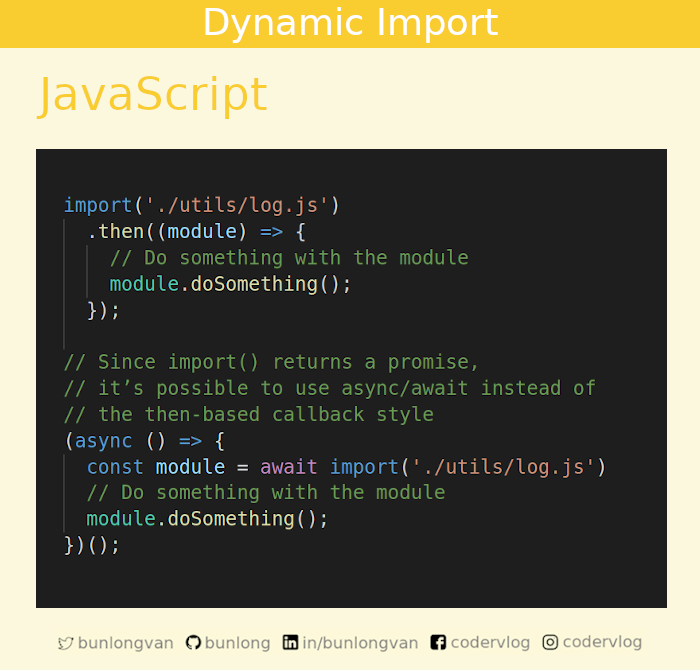</p>

### [Better Array Check](#better-array-check)

In JavaScript arrays are not true arrays. So you can't simply do a `typeof` check. But not a problem! With ES6, finally there is an easier way to check if a value is an actual array. Use `Array.isArray()`.

Code:

```javascript
const books = ['📕', '📙', '📗'];


// ❌ Does not work
typeof books; // 'object'

// Old way
Object.prototype.toString.call(books) === '[object Array]'; // true

// ES6
// ✅ Better
Array.isArray(books); // true
```

Image:

<p>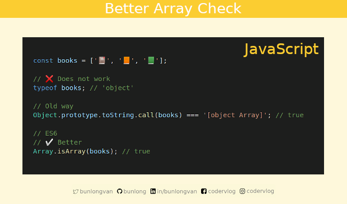</p>

### [Get Unique Values of an Array](#get-unique-values-of-an-array)

Code:

```javascript
// Get Unique Values of an Array

let newArray = [...new Set([1, 2, 3, 3])];

console.log(newArray);

// newArray result
// [1, 2, 3]
```

Image:

<p>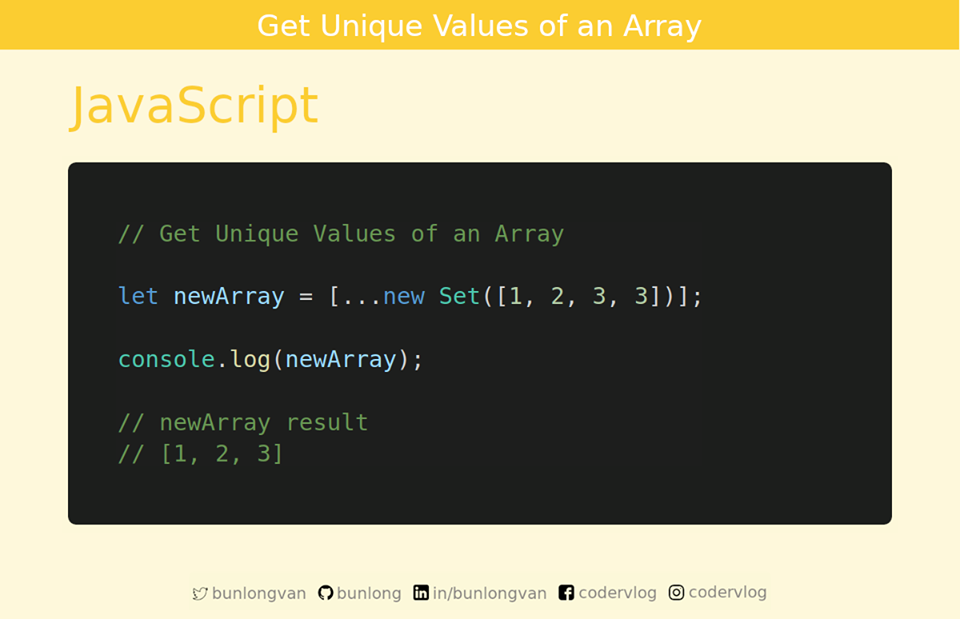</p>

### [Short-circuit Evaluation and Assignment Using && ||](#short-circuit-evaluation-and-assignment-using-and-or)

Code:

```javascript
const foo = 10;

foo = 10 && doSomething(); // short circuit of if (foo == 10) doSomething();


foo == 5 || doSomething(); // short circuit of if (foo != 5) doSomething();

// Set a default value for function argument
function doSomething(arg) {
  arg = arg || 10; // arg will have 10 as a default value if it's not set
}
```

Image:

<p>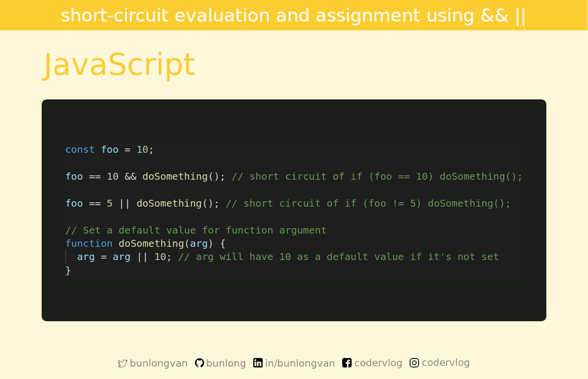</p>

## 👋 Say Hello

> I share code tidbits every week!

Twitter: [@bunlongvan](https://twitter.com/bunlongvan)  
GitHub: [@bunlong](https://github.com/bunlong)  
LinkedIn: [@bunlongvan](https://www.linkedin.com/in/bunlongvan)  
Facebook: [@codervlog](https://www.facebook.com/codervlog)  
Instagram: [@codervlog](https://www.instagram.com/codervlog)

## 💖 Download & Share

Absolutely! You are more than welcome to download and share my code tidbits. If you've gotten any value from my content and would like to help me reach more people, please do share!

One thing that I kindly ask is that you don't edit the images or crop my name out. Please leave the images intact. Thank you for choosing to do the right thing 😇

## 🌟 Contribution

Yes! Anyone is welcome to contribute to the quality of this content. Please feel free to submit a PR request for typo fixes, spelling corrections, explanation improvements, etc. If you want to help translate the tutorial, that's even cooler!

## 🏻‍⚖️ License

Thank you for wanting to share and include my work in your project 😊 If you're wondering how to provide attributions. It simply means don't edit the images. There is attribution automatically built into them. Easy peasy right! So you don't have to provide additional attribution when you share the images ⭐️

<a rel="license" href="http://creativecommons.org/licenses/by-nc-nd/4.0/"></a><br />This work is licensed under a <a rel="license" href="http://creativecommons.org/licenses/by-nc-nd/4.0/">Creative Commons Attribution-NonCommercial-NoDerivatives 4.0 International License</a>.
