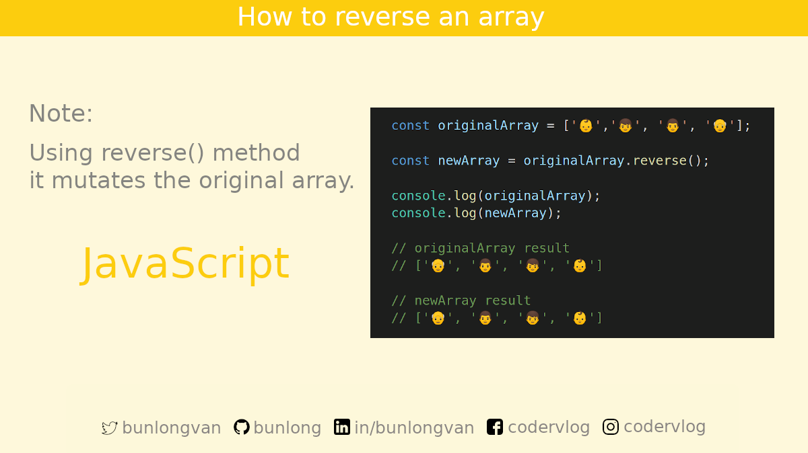
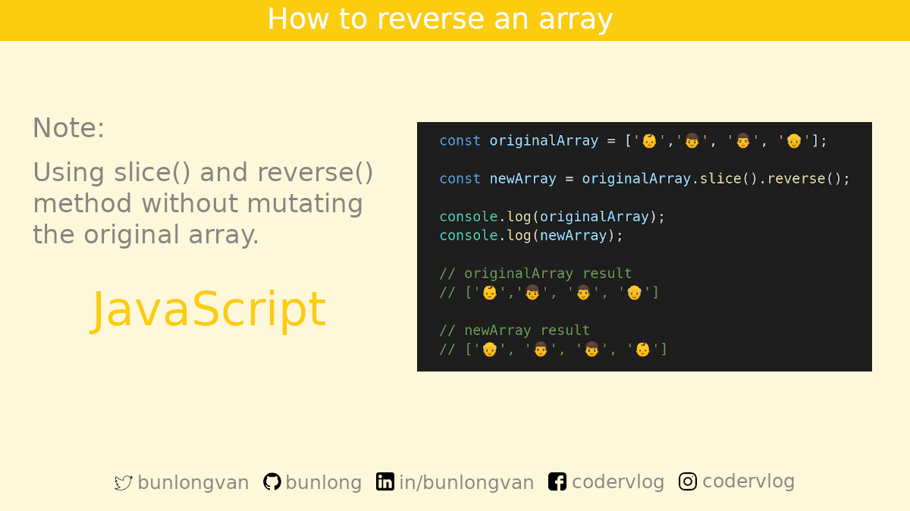

# 📚 JavaScript Tips, Tricks and Best Practices

### [How to Reverse an Array Using `reverse` Method](#how-to-reverse-an-array-using-reverse-method)

### [How to Reverse an Array Using `slice` and `reverse` Method](#how-to-reverse-an-array-using-slice-and-reverse-method)

## 👋 Say Hello

> I share code tidbits every week!

Twitter: [@bunlongvan](https://twitter.com/bunlongvan)
GitHub: [@Bunlong](https://github.com/bunlong)
LinkedIn: [@bunlongvan](https://www.linkedin.com/in/bunlongvan)
Facebook: [@codervlog](https://www.facebook.com/codervlog)
Instagram: [@codervlog](https://www.instagram.com/codervlog)

## 💖 Download & Share

Absolutely! You are more than welcome to download and share my code tidbits. If you've gotten any value from my content and would like to help me reach more people, please do share!

One thing that I kindly ask is that you don't edit the images or crop my name out. Please leave the images intact. Thank you for choosing to do the right thing 😇

## 🌟 Contribution

Yes! Anyone is welcome to contribute to the quality of this content. Please feel free to submit a PR request for typo fixes, spelling corrections, explanation improvements, etc. If you want to help translate the tutorial, that's even cooler!

## 🏻‍⚖️ License

Thank you for wanting to share and include my work in your project 😊 If you're wondering how to provide attributions. It simply means don't edit the images. There is attribution automatically built into them. Easy peasy right! So you don't have to provide additional attribution when you share the images ⭐️

 This work is licensed under a <a rel="license" href="http://creativecommons.org/licenses/by-nc-nd/4.0/">Creative Commons Attribution-NonCommercial-NoDerivatives 4.0 International License</a>.
